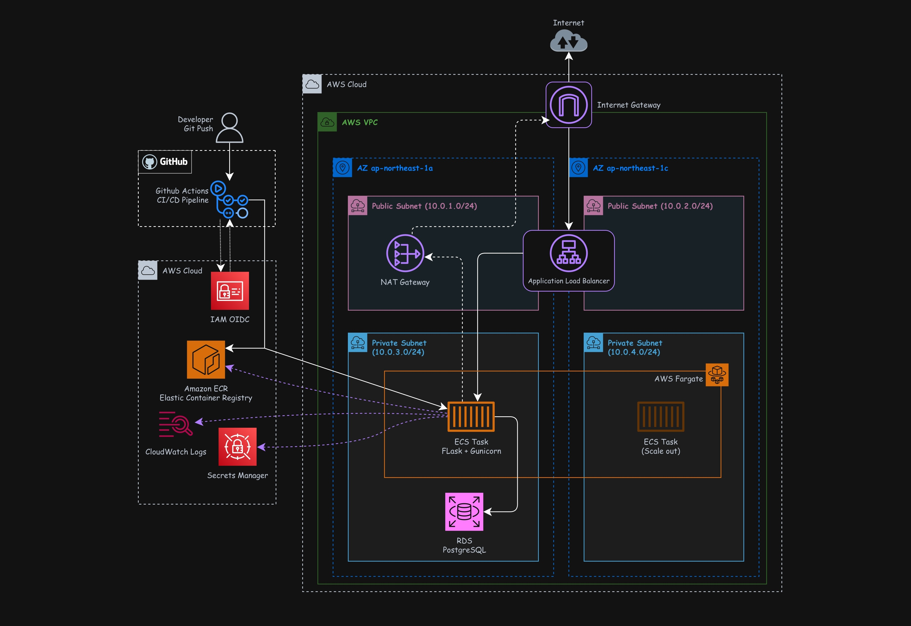
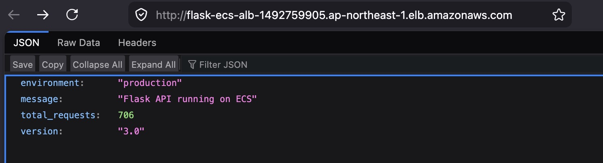
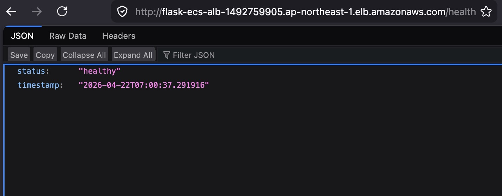
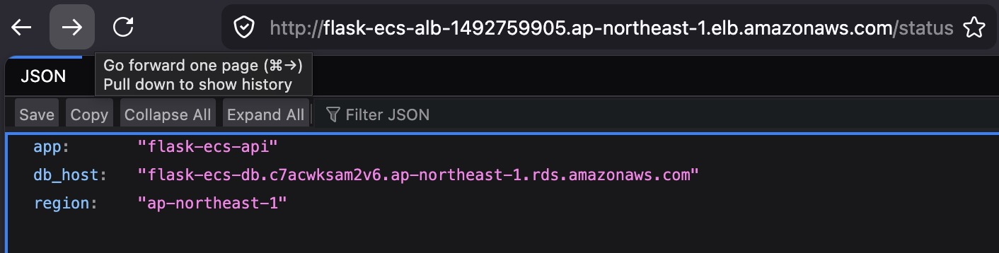

# Flask ECS API

A containerized Python REST API deployed on AWS ECS Fargate — demonstrates secure multi-tier architecture with private networking, managed database, and fully automated CI/CD.


Kevinn Ramirez - [Portfolio Page](https://kevinnramirez.com) · [LinkedIn](https://linkedin.com/in/kevinnramirez)

---

## Architecture



Traffic enters through an Internet Gateway and reaches the Application Load Balancer in public subnets. The ALB forwards requests to ECS Fargate tasks running in private subnets, which connect to an RDS PostgreSQL instance also isolated in private subnets. Database credentials are never stored in code — ECS pulls them from Secrets Manager at container startup via an IAM execution role.

> [!WARNING] The AWS infrastructure for this project (ECS service, RDS, ALB, NAT Gateway) has been torn down to avoid ongoing costs. The architecture diagram and documentation reflect the fully working system that was deployed and tested. The Docker image and application code run locally following the instructions below.

---

## Tech Stack

| Service | Purpose |
|---|---|
| Python + Flask | REST API application |
| Gunicorn | Production WSGI server |
| Docker | Container image |
| Amazon ECR | Container registry |
| ECS Fargate | Serverless container compute |
| Application Load Balancer | Public traffic entry, health checks |
| RDS PostgreSQL | Managed relational database |
| VPC | Isolated network with public/private subnets |
| NAT Gateway | Outbound internet for private subnet resources |
| AWS Secrets Manager | Database credential storage |
| CloudWatch Logs | Container log aggregation |
| GitHub Actions + OIDC | CI/CD pipeline, no stored credentials |

---

## Features

- Built a custom VPC with public and private subnet separation across two Availability Zones
- Deployed ECS Fargate service in private subnets with no public IP exposure
- Configured Application Load Balancer with `/health` health checks routing to ECS tasks
- Implemented security group chaining — RDS accepts connections only from the ECS security group
- Stored database credentials in Secrets Manager, injected at container startup via IAM role
- Automated CI/CD pipeline using GitHub Actions with OIDC — no AWS keys stored in GitHub
- Built Docker images cross-compiled for `linux/amd64` to ensure ECS compatibility from Apple Silicon

---

## Project Structure

<details>
<summary>View file tree</summary>

```
flask-ecs-api/
├── app/
│   ├── main.py              # Flask app — endpoints, SQLAlchemy models, env var config
│   └── requirements.txt     # Python dependencies (Flask, gunicorn, psycopg2, SQLAlchemy)
├── .github/
│   └── workflows/
│       └── deploy.yml       # CI/CD pipeline — build, push to ECR, deploy to ECS
├── Dockerfile               # Container definition — python:3.12-slim, gunicorn entrypoint
├── .dockerignore            # Excludes __pycache__, .env, .git from image
└── task-definition.json     # ECS task definition — CPU, memory, env vars, secret refs
```

</details>

---

## How to Run Locally

**Prerequisites:** Docker Desktop, Python 3.12+

```bash
# Clone the repo
git clone https://github.com/Kevinnra/flask-ecs-api.git
cd flask-ecs-api

# Build the image
docker build -t flask-api:local .

# Run with environment variables
docker run -p 8080:5000 \
  -e ENVIRONMENT=local \
  flask-api:local
```

**Expected output:**
```
[INFO] Starting gunicorn 22.0.0
[INFO] Listening at: http://0.0.0.0:5000
[INFO] Booting worker with pid: ...
```

Test the endpoints:
```bash
curl http://localhost:8080/health
# {"status": "healthy", "timestamp": "..."}

curl http://localhost:8080/
# {"message": "Flask API running on ECS", "version": "3.0", ...}
```

> **Apple Silicon note:** Use `docker buildx build --platform linux/amd64` for ECS-compatible builds.

## Proof it works

API running live on ECS behind the Application Load Balancer:




---

## Key Decisions

- **Chose ECS Fargate over EC2** — no server management needed; the goal was learning container orchestration, not instance administration
- **Chose OIDC over stored IAM credentials** — GitHub gets a short-lived token per workflow run instead of long-lived access keys that need rotation and can leak
- **Chose Secrets Manager over task definition env vars** — task definitions are visible to anyone with IAM describe permissions; credentials should never appear in plain text there
- **Chose NAT Gateway over VPC Endpoints** — VPC Endpoints are cheaper long-term but more complex; NAT Gateway was the right tradeoff for a learning project that tears down between sessions
- **Chose security group chaining over CIDR rules** — referencing a security group as the source means permissions follow resources even if their IPs change

---

## Challenges and Solutions

- **Problem:** ECS failed to pull the image with `platform mismatch: linux/amd64` → **Solution:** Apple Silicon builds `arm64` by default; added `--platform linux/amd64` to the build command and baked it into the GitHub Actions workflow permanently
- **Problem:** ECS tasks in private subnets could not reach ECR to pull images → **Solution:** Deployed a NAT Gateway in the public subnet and added a `0.0.0.0/0` route in the private route table pointing to it
- **Problem:** ECS service stuck at 0 running tasks with no visible error → **Solution:** Checked service events with `aws ecs describe-services --query 'services[0].events'` — the failure reason was in the events list, not the task logs

---

## Lessons Learned

- The NAT Gateway is the most expensive invisible resource in a basic VPC — knowing when to replace it with VPC Endpoints is a real cost optimization skill
- Security groups are additive by default — building the three-layer chain (ALB → ECS → RDS) made the concept of least-privilege networking concrete, not theoretical
- Debugging containerized deployments requires knowing which layer broke: CloudWatch for app errors, ECS service events for deployment failures, VPC for network issues
- OIDC for CI/CD is simpler than managing IAM users — fewer things to rotate, fewer things that can leak
- `0.0.0.0` in Flask is about network interfaces, not ports — without it the app only listens to itself inside the container

---
## Author

Build with ☁️ by Kevinn Ramirez - [Web Portfolio](https://www.kevinnramirez.com) · [LinkedIn](https://www.linkedin.com/in/kevinnramirez)
